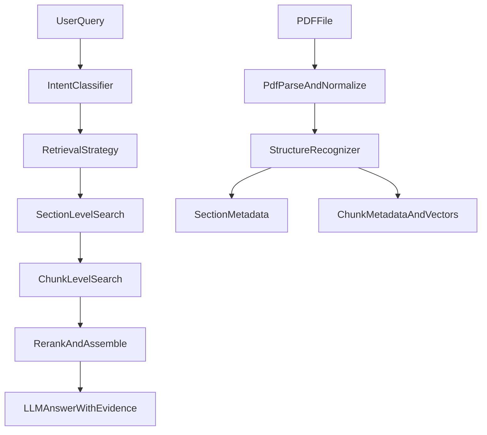

# 分层/结构化检索实现方案

## 目标

- 把当前“平铺 chunk 向量检索”升级为“结构化入库 + 意图驱动 + 分层召回”。
- 优先服务论文阅读场景：总结、方法解释、实验对比、局限分析、术语解释。
- 保持现有桌面端交互不大改，核心改动集中在主进程服务层。

## 当前锚点

- 入库与检索主逻辑在 [D:/97Project/electron-app/src/main/services/ragService.ts](D:/97Project/electron-app/src/main/services/ragService.ts)
- Agent/tool 入口在 [D:/97Project/electron-app/src/main/services/aiService.ts](D:/97Project/electron-app/src/main/services/aiService.ts) 和 [D:/97Project/electron-app/src/main/services/tools.ts](D:/97Project/electron-app/src/main/services/tools.ts)
- 论文状态存储在 [D:/97Project/electron-app/src/main/services/paperStorage.ts](D:/97Project/electron-app/src/main/services/paperStorage.ts)
- 导入与阅读上下文在 [D:/97Project/electron-app/src/renderer/src/App.vue](D:/97Project/electron-app/src/renderer/src/App.vue)、[D:/97Project/electron-app/src/renderer/src/components/PaperReader.vue](D:/97Project/electron-app/src/renderer/src/components/PaperReader.vue)、[D:/97Project/electron-app/src/renderer/src/components/AIChat.vue](D:/97Project/electron-app/src/renderer/src/components/AIChat.vue)
- IPC 与前后端契约在 [D:/97Project/electron-app/src/main/index.ts](D:/97Project/electron-app/src/main/index.ts) 和 [D:/97Project/electron-app/src/preload/index.d.ts](D:/97Project/electron-app/src/preload/index.d.ts)

## 总体流程

## 阶段 1：入库时的结构识别

### 目标

- 让每个 chunk 不再只有 `paperId/chunkIndex/source`，而是带上论文结构信息。
- 先做“弱结构识别”，优先可落地，不追求一次性精准解析所有 PDF 排版。

### 依赖选型

- 推荐优先方案：复用项目里已经存在的 `pdfjs-dist`
  - 原因：项目当前已安装 [D:/97Project/electron-app/package.json](D:/97Project/electron-app/package.json) 中的 `pdfjs-dist`，无需新增依赖。
  - 能力：可获取逐页文本项、坐标、变换矩阵、字体名、宽高等版面特征，足以支撑“标题候选识别 + 行合并 + 章节切分”。
  - 适配性：更适合自己控制识别规则，避免后期被第三方封装限制。
- 可选方案 A：新增 `pdf.js-extract`
  - 优点：是 `pdf.js` 的高层封装，直接返回页内容与 `x/y/font` 信息，能减少自己写抽取适配层的成本。
  - 缺点：本质仍是基于 `pdf.js`，但会引入额外依赖与包体；对你当前项目来说收益不如直接使用已安装的 `pdfjs-dist`。
- 可选方案 B：新增 `pdfreader`
  - 优点：可以拿到 `{ text, x, y, w }` 这类项目级坐标，做规则识别门槛低。
  - 缺点：更偏 Node 侧表格/规则解析，底层依赖 `pdf2json`，对论文结构识别的可控性不如直接使用 `pdfjs-dist`。
- 不建议继续仅依赖当前 `pdf-parse.getText()`
  - 原因：它更适合纯文本提取；阶段 1 需要标题大小、位置、页码、行结构等信息，仅凭纯文本很难稳定识别章节。

### 方案结论

- 阶段 1 首版采用“`pdfjs-dist` + 自实现弱结构识别规则”。
- 只有在 `pdfjs-dist` 接入成本明显过高，或 Node 侧读取 API 在 Electron 主进程里兼容性不理想时，再退而求其次改为 `pdf.js-extract`。
- `pdf-parse` 暂时仍可保留：
  - 作为旧链路 fallback；
  - 或作为“纯文本兜底提取”手段，在结构识别失败时仍保证可向量化。

### 方案

- 在 `RAGService.addPaper()` 中，把当前“全文 `getText()` -> 直接 `splitText()`”改为“两步处理”：
  - 先做文本标准化与章节识别。
  - 再按章节内分块，生成带结构元数据的 chunk。
- 首版结构识别采用启发式规则：
  - 识别常见标题：`Abstract`、`Introduction`、`Method`、`Experiment`、`Results`、`Discussion`、`Conclusion`、`References`
  - 兼容编号标题：`1 Introduction`、`3.2 Ablation Study`
  - 为 chunk 补充 metadata：`sectionTitle`、`sectionType`、`sectionLevel`、`chunkInSection`、`paperId`、`source`
- 若当前 PDF 解析库拿不到稳定页码，首版先不把 `page` 作为强依赖；页码放到第二轮增强。
- 为了避免后续难调试，增加一个“结构化入库调试输出”能力：至少能在日志或调试方法里看到某篇论文被切成了哪些 section。

### 分步实现

#### 1.1 抽取页级文本项

- 新增一个独立的 PDF 结构抽取层，不要把识别规则全部塞进 `RAGService.addPaper()`。
- 建议职责拆分：
  - `extractPdfLayout(pdfPath)`：从 PDF 中抽取页、行、文本项
  - `detectSections(layout)`：基于版面特征识别章节
  - `buildStructuredChunks(sections)`：按 section 内分块并生成 metadata
- 首版抽取结果建议统一成这样的中间结构：
  - `pageNumber`
  - `items[]`
    - `text`
    - `x/y`
    - `width/height`
    - `fontName`
    - `fontSize`
    - `hasEOL`
- 关键目标不是还原完整排版，而是获得“行级文本”和“标题特征”。

#### 1.2 行合并与正文标准化

- 将同一页中 `y` 接近的文本项合并为一行。
- 处理基础噪声：
  - 去掉重复页眉/页脚
  - 尝试识别页码行并标记，不计入正文
  - 合并被拆开的单词和异常空格
- 生成 `LineBlock[]`，每行至少保留：
  - `text`
  - `pageNumber`
  - `xMin/xMax/y`
  - `fontSizeAvg/fontSizeMax`
  - `fontNameSet`
  - `isLikelyHeaderFooter`

#### 1.3 标题候选识别

- 对每个 `LineBlock` 计算标题分数 `headingScore`，分数来源建议采用规则加权：
  - 文本模式分：
    - 命中 `Abstract`、`Introduction`、`Conclusion` 等常见标题
    - 命中编号标题：`1 Introduction`、`2.1 Method`
  - 版面特征分：
    - 字体更大
    - 单行更短
    - 居中或左侧缩进明显
    - 上下留白更大
    - 使用粗体或不同字体族
  - 负向规则：
    - 句末带句号
    - 行过长
    - 明显属于作者、单位、版权说明
- 首版不要追求完整标题层级树，只需要稳定识别“一级章节”和少量关键二级标题。

#### 1.4 section 构建与类型映射

- 以标题候选行为边界，把正文切成 section。
- 每个 section 产出：
  - `sectionId`
  - `title`
  - `level`
  - `type`
  - `startPage/endPage`
  - `content`
  - `lineStart/lineEnd`
- `sectionType` 建议先映射到有限集合：
  - `title`
  - `abstract`
  - `introduction`
  - `related_work`
  - `method`
  - `experiment`
  - `result`
  - `discussion`
  - `conclusion`
  - `reference`
  - `other`
- 类型映射优先靠标题词典和正则，不在阶段 1 做复杂语义分类。

#### 1.5 section 内分块

- 不再对整篇论文统一 `splitText()`，而是改成“section 内部分块”。
- 建议 chunk 仍保持较保守参数，避免改动太大：
  - `chunkSize` 先沿用当前 1000 左右
  - `chunkOverlap` 保持 150-200
- 每个 chunk 需要附带：
  - `paperId`
  - `source`
  - `sectionId`
  - `sectionTitle`
  - `sectionType`
  - `sectionLevel`
  - `chunkIndex`
  - `chunkInSection`
  - `pageStart/pageEnd`
- 如果页码在首版不稳定，也至少保留 `sectionStartPage/sectionEndPage` 或 `pageHint`。

#### 1.6 调试与回退

- 阶段 1 必须提供结构识别调试输出，否则很难定位错误：
  - 每篇论文识别出的 section 列表
  - 每个 section 的标题、页码范围、chunk 数
  - 未识别标题时的 fallback 原因
- 失败回退策略：
  - 若 `pdfjs-dist` 抽取失败，直接走现有 `pdf-parse` 文本向量化链路
  - 若抽取成功但识别不到有效章节，则生成单个 `other/body` section，保证功能不中断

### 建议新增的内部结构

- `PdfTextItem`
- `PdfLineBlock`
- `SectionCandidate`
- `StructuredSection`
- `StructuredChunkMetadata`

这些类型优先放在主进程服务层附近，避免后续阶段 2、3 再重复改字段定义。

### 建议代码落点

- 保持现有入口不变：仍由 [D:/97Project/electron-app/src/main/services/ragService.ts](D:/97Project/electron-app/src/main/services/ragService.ts) 的 `addPaper()` 触发。
- 但建议把结构化能力拆到新文件，避免 `ragService.ts` 过快膨胀：
  - `src/main/services/pdfLayoutService.ts`
  - `src/main/services/pdfStructureService.ts`
  - `src/main/services/types/pdfStructure.ts`
- `ragService.ts` 负责编排：
  - 读取 PDF
  - 调用结构识别服务
  - 分块
  - embedding
  - Chroma 入库

### 阶段 1 的迭代拆分

#### 子阶段 1A：最小可运行版

- 接入 `pdfjs-dist`
- 拿到页级文本项与基础行结构
- 基于正则识别一级标题
- 写入 `sectionTitle/sectionType`
- 保留原有向量入库逻辑

#### 子阶段 1B：稳定性增强版

- 加入字体大小、留白、居中度等特征
- 支持 `1.1` / `3.2` 这类二级标题
- 过滤页眉页脚、参考文献噪声
- 补充调试输出

#### 子阶段 1C：检索友好版

- 补 `pageStart/pageEnd`
- 输出 section 摘要或 section 级统计信息，供阶段 3 复用
- 为后续章节级召回预留 `sectionId`

### 主要改动点

- [D:/97Project/electron-app/src/main/services/ragService.ts](D:/97Project/electron-app/src/main/services/ragService.ts)
- 如需持久化结构摘要，可扩展 [D:/97Project/electron-app/src/main/services/paperStorage.ts](D:/97Project/electron-app/src/main/services/paperStorage.ts)，但首版可先只写入 Chroma metadata。

### 验收标准

- 新导入论文的向量 metadata 至少包含 `sectionTitle` 和 `sectionType`。
- 对 3-5 篇常见论文，能识别出主要章节，且 `References` 不再成为主要召回来源。
- 旧的 `rag:addPaper` 流程和 `index_status` 流程保持可用。

### 阶段 1 的完成定义

- 至少 70% 的常规论文能识别出 `abstract/introduction/method/experiment/conclusion/reference` 中的 3 个以上主要章节。
- 结构识别失败时，不影响原有论文入库与问答能力。
- 后续阶段 2、3 可以直接消费 `sectionId/sectionTitle/sectionType` 这些字段，而不需要重做入库数据模型。

## 阶段 2：意图识别

### 目标

- 在检索前判断“用户到底在问什么”，让检索有明确策略，而不是总是全论文平铺搜 4 段。

### 方案

- 在 `AIService.chat()` 中，`createAgent()` 之前增加一个轻量意图分类步骤。
- 首版采用规则优先、模型兜底的混合方式：
  - 规则命中关键词时直接判定，如“总结/速读/概述” -> `summary`，"方法/原理/怎么做" -> `method`，"优势/对比/baseline" -> `comparison`，"局限/不足/future work" -> `limitation`，"术语/什么意思" -> `definition`
  - 规则不确定时，再让一个低成本模型或 prompt 产出 `intent + reason`
- 输出统一的检索策略对象，例如：
  - `intent`
  - `preferredSectionTypes`
  - `searchMode`（`singlePaper` / `crossPaper`）
  - `topKSections`
  - `topKChunks`
- 将该策略注入 `createRetrieveTool()` 或新的 `RAGService.searchStructured()`，而不是只传 `paperId`。
- 对 `comparePapers`、`batchSummaries`、`extractTermCards` 也逐步复用这套 intent/strategy，而不是继续写死 query。

### 主要改动点

- [D:/97Project/electron-app/src/main/services/aiService.ts](D:/97Project/electron-app/src/main/services/aiService.ts)
- [D:/97Project/electron-app/src/main/services/tools.ts](D:/97Project/electron-app/src/main/services/tools.ts)
- 若前后端要透出调试信息，再扩展 [D:/97Project/electron-app/src/preload/index.d.ts](D:/97Project/electron-app/src/preload/index.d.ts)

### 验收标准

- 常见 5 类问题能稳定映射到对应 intent。
- 检索请求能带上 `preferredSectionTypes` 等策略字段。
- `paperId` 已存在时，仍默认单论文优先，避免串论文召回。

## 阶段 3：分层检索

### 目标

- 把检索改成“先找相关章节，再找章节内证据段落”，并为答案提供更可信的证据来源。

### 方案

- 在 `RAGService` 中拆出两层检索：
  - `section-level retrieval`：按 query + intent 找最相关的 section
  - `chunk-level retrieval`：仅在候选 section 内检索 chunk
- 实现方式建议从轻到重分两步：
  - 第一步：不新建独立 section collection，直接利用 chunk metadata 做 section 聚合和候选过滤。
  - 第二步：如果效果不足，再新增章节级索引或独立 collection。
- 召回后增加简单重排：
  - section 优先级分
  - query 相似度分
  - 是否命中用户 `selectedText`
  - 是否与 `currentPage` 邻近（若后续补齐页码）
- `createRetrieveTool()` 输出内容从“只返回 chunk 文本”升级为“返回 section + chunk + 来源信息”。
- 回答模板升级为“答案 + 证据摘要”，至少能显示章节名；有页码后再补页码引用。

### 主要改动点

- [D:/97Project/electron-app/src/main/services/ragService.ts](D:/97Project/electron-app/src/main/services/ragService.ts)
- [D:/97Project/electron-app/src/main/services/tools.ts](D:/97Project/electron-app/src/main/services/tools.ts)
- [D:/97Project/electron-app/src/main/services/aiService.ts](D:/97Project/electron-app/src/main/services/aiService.ts)

### 验收标准

- “总结类”问题主要召回 `abstract/introduction/conclusion`。
- “方法类”问题主要召回 `method`。
- “对比/优势类”问题主要召回 `experiment/result/ablation`。
- 工具返回结果可见 `sectionTitle/sectionType`，回答可引用来源章节。

## 建议迭代顺序

1. 先完成阶段 1，把结构化 metadata 打进去，否则后两阶段无从做起。
2. 再做阶段 2 的规则版意图识别，尽快让检索开始“按问题走不同路径”。
3. 最后实现阶段 3 的 section -> chunk 分层召回；不要一开始就上独立章节索引。
4. 等效果稳定后，再补页码、图表 caption、术语实体索引、混合检索。

## 风险与取舍

- PDF 文本顺序可能因双栏排版失真，因此阶段 1 先做弱结构识别，不把复杂版面恢复作为前置条件。
- 不建议一开始就引入太多新表或新 collection；首轮优先复用现有 `papers` collection 和 metadata。
- 意图识别首版以规则为主，避免先把问题复杂化到“再做一个分类 agent”。

## MVP 完成定义

- 用户导入论文后，系统能识别主要章节并写入 metadata。
- 用户提问时，系统能先判定问题类型，再按 section 策略检索。
- 最终回答可显示“内容来自哪一章节”，并显著减少无关章节召回。

