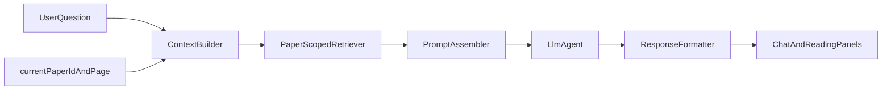

# 论文辅助阅读Agent（MVP）功能规划

## 目标与边界

- 目标：先把“单篇论文阅读效率”做到明显提升，再扩展到多论文对比。
- 阶段：MVP（2-4周可落地）。
- 优先级：效率优先，其次保证基础可信度。

## 功能分层

### P0 核心能力（MVP必须）

- **文档导入与索引稳定化**：导入PDF后可查询，索引状态可见（进行中/完成/失败）。
- **面向当前论文的问答**：默认只检索当前选中文献，避免跨文献串答。
- **一键阅读动作**：提供固定快捷任务按钮：
  - 3分钟速读（研究问题/方法/贡献）
  - 章节摘要（按IMRaD或论文结构）
  - 术语解释（面向初学者）
  - 关键结论提取（可直接复制）
- **会话上下文增强**：问题可带“当前页/当前选中文本”上下文（用户不必反复描述）。
- **结果结构化输出**：统一模板（要点列表 + 下一步建议），减少长段落噪音。

### P1 增强能力（MVP后紧跟）

- **多论文快速对比**：输入多个paper，输出“问题-方法-数据集-结论-局限”对照。
- **批量任务**：批量生成每篇的“摘要卡片 + 关键词 + 方法标签”。
- **阅读笔记联动**：支持把问答结果保存为笔记，按paper归档。
- **术语卡片与回顾**：自动抽取高频术语，生成复习卡。

### P2 进阶能力（后续版本）

- **证据可追溯**：回答中的关键句可回跳到原文片段位置。
- **实验/方法抽取**：结构化抽取模型、数据集、指标、SOTA对比。
- **个性化阅读策略**：按用户背景（新手/研究者）控制回答深度。

## MVP信息架构（建议）

## 结合现有项目的落点

- 前端交互与入口：`[d:/97Project/electron-app/src/renderer/src/components/AIChat.vue](d:/97Project/electron-app/src/renderer/src/components/AIChat.vue)`、`[d:/97Project/electron-app/src/renderer/src/components/PaperReader.vue](d:/97Project/electron-app/src/renderer/src/components/PaperReader.vue)`
- 主流程编排：`[d:/97Project/electron-app/src/main/services/aiService.ts](d:/97Project/electron-app/src/main/services/aiService.ts)`
- 检索与索引：`[d:/97Project/electron-app/src/main/services/ragService.ts](d:/97Project/electron-app/src/main/services/ragService.ts)`、`[d:/97Project/electron-app/src/main/services/tools.ts](d:/97Project/electron-app/src/main/services/tools.ts)`
- 助手行为规范：`[d:/97Project/electron-app/resources/system.md](d:/97Project/electron-app/resources/system.md)`

## 验收标准（MVP）

- 用户在单篇论文中连续提3类问题（摘要/术语/结论）均能在10秒内得到可读结果。
- 回答风格统一为结构化模板，且无需用户重复粘贴上下文。
- 至少4个快捷动作可直接触发并稳定返回结果。
- 索引失败可见、可重试，不出现“静默失败”。

## 实施节奏（2-4周）

- 第1周：Paper作用域检索 + 快捷动作模板 + 基础状态提示。
- 第2周：当前页/选中文本上下文接入 + 输出格式器。
- 第3-4周：多论文对比与批量摘要（P1首批）。

